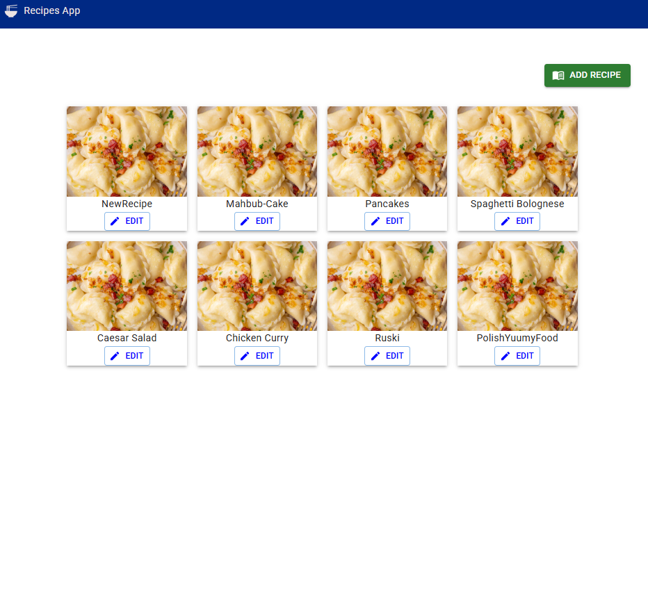

## TODO

1. Add nice styling to the components - Mahbub
2. Fix improvements TODOS.
3. Solve API requests functions
4. Add react-testing-library tests
5. Refactor useRecipes to go to hooks folder.
6. Reuse goback button somehow

JSS

## HOMEWORK

- How you can add custom classes to MUI components.

```javascript
const
```

test

# Demo images


